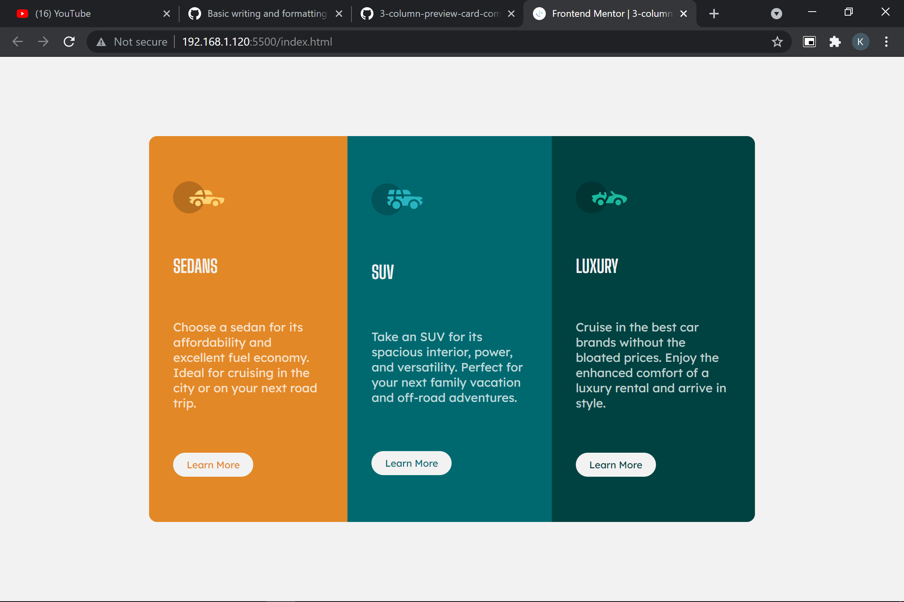

# Frontend Mentor - 3-column preview card component solution

This is a solution to the [3-column preview card component challenge on Frontend Mentor](https://www.frontendmentor.io/challenges/3column-preview-card-component-pH92eAR2-). Frontend Mentor challenges help you improve your coding skills by building realistic projects. 

## Table of contents

  - [The challenge](#the-challenge)
  - [Screenshot](#screenshot)
  - [Links](#links)
- [My process](#my-process)
  - [Built with](#built-with)
  - [What I learned](#what-i-learned)
  - [Continued development](#continued-development)
  - [Useful resources](#useful-resources)
- [Author](#author)
- [Acknowledgments](#acknowledgments)

### The challenge

Users should be able to:

- View the optimal layout depending on their device's screen size
- See hover states for interactive elements

### Screenshot

. In my laptop.

### Links

- Solution URL: [solution here](https://github.com/kar-cee/3-column-preview-card-component1)
- Live Site URL: [live site here](https://kar-cee.github.io/3-column-preview-card-component1/)

## My process

### Built with

- Semantic HTML5 markup
- CSS flexbox
- CSS Grid
- Mobile-first workflow

### What I learned

** I learn to make responsive web on device like mobile and desktop **

### Continued development

In near future I want to foucs more on animation and transtion. Specially interactive one.
let hope for the best and prepare for worst.

## Author

- Frontend Mentor - [@kar-cee](https://www.frontendmentor.io/profile/kar-cee)
- Facebook - [@kartse](https://www.facebook.com/kar.tse.334)

## Acknowledgments

All my credit goes to the amazing youtuber out  there, how share their premium course and never ending undating.

Also to the open source and my best tuber [@codywithharry](https://www.youtube.com/channel/UCeVMnSShP_Iviwkknt83cww)

